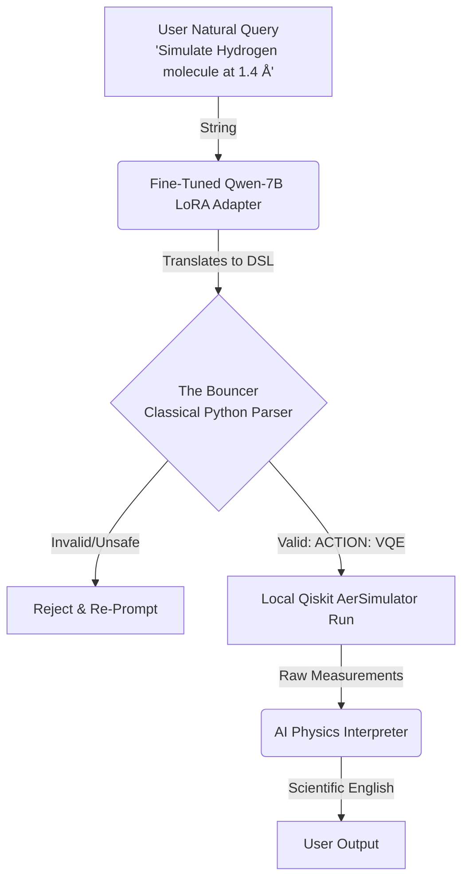

# 🌌 QAC-L: Quantum Action Codec 
### Neuro-Symbolic Compiler Adapter for Qwen2.5-Coder-7B

  
  
  
  

*A lightweight, deterministic bridge between natural language and quantum execution.*  
**Developed by [Pulsate Labs](https://pulsatelabs.co.za)**

---

## 🧠 What It Is & What It Does

In conversational quantum computing systems, asking a Large Language Model to generate raw Python/Qiskit code on the fly is highly unstable. It leads to API deprecations, syntax hallucinations, and execution safety risks. 

**This LoRA adapter solves that problem.** By acting as a strict intermediary compiler, it restricts the LLM's output to a custom, highly-structured **Quantum Domain-Specific Language (DSL)**. This output is easily parsed, validated, and executed by a classical software boundary (the "Bouncer" shield), ensuring 100% stable execution.

### ⚡ Supported Translations

**1. Quantum Superposition / Randomness:**
> **User Input:** *"Can you do a quantum coin flip using 3 qubits?"*  
> **DSL Output:** `[ACTION: RANDOM] [QUBITS: 3]`

**2. Quantum Chemistry (H₂ VQE):**
> **User Input:** *"Hey, compute the ground state energy of hydrogen with a distance of 1.4 Angstroms."*  
> **DSL Output:** `[ACTION: VQE] [DISTANCE: 1.4]`

---

## ⚙️ How It Works (System Architecture)

The architecture relies on a **Neuro-Symbolic** loop, separating the creative translation of natural language from the strict mathematical execution of the quantum circuit.

### 🔬 The Fine-Tuning Process
The model was fine-tuned on a synthetic dataset of **1,200 conversational-to-DSL pairs** generated using randomized, physically realistic parameter variations ($N \in [1, 5]$ qubits, $D \in [0.5, 2.5]$ Å). 

Using **QLoRA** (Quantized Low-Rank Adaptation) on dual T4 GPUs, the model's training loss dropped from **`1.89`** to **`0.11`**, indicating stable convergence and flawless syntactic replication of the target DSL.

---

## 📊 Comparison with Similar Approaches

When building AI-Quantum interfaces, developers typically use one of two architectures. Here is why the **QAC-L Neuro-Symbolic pipeline** outperforms standard generation:

| Feature | Standard LLM Code Gen (Raw Qiskit) | QAC-L Adapter + Bouncer (Ours) |
| :--- | :--- | :--- |
| **Method** | LLM writes raw Python script containing Qiskit commands. | LLM compiles parameters into a strict, validated schema. |
| **Syntax Stability** | ❌ **Poor.** Generates deprecated functions or incorrect imports. |  **High.** 100% stable. Classical Python handles the API calls. |
| **Security / Safety** | ❌ **Low.** Vulnerable to Prompt Injection (running arbitrary OS code). |  **High.** Sanitized by regex parser. Malformed inputs are blocked. |
| **VRAM Footprint** | ❌ **Heavy.** Requires massive frontier models (GPT-4) for reliability. |  **Light.** Runs efficiently on local consumer hardware (7B Q4). |

***

*Built for the future of Embodied AI and Quantum Control*
